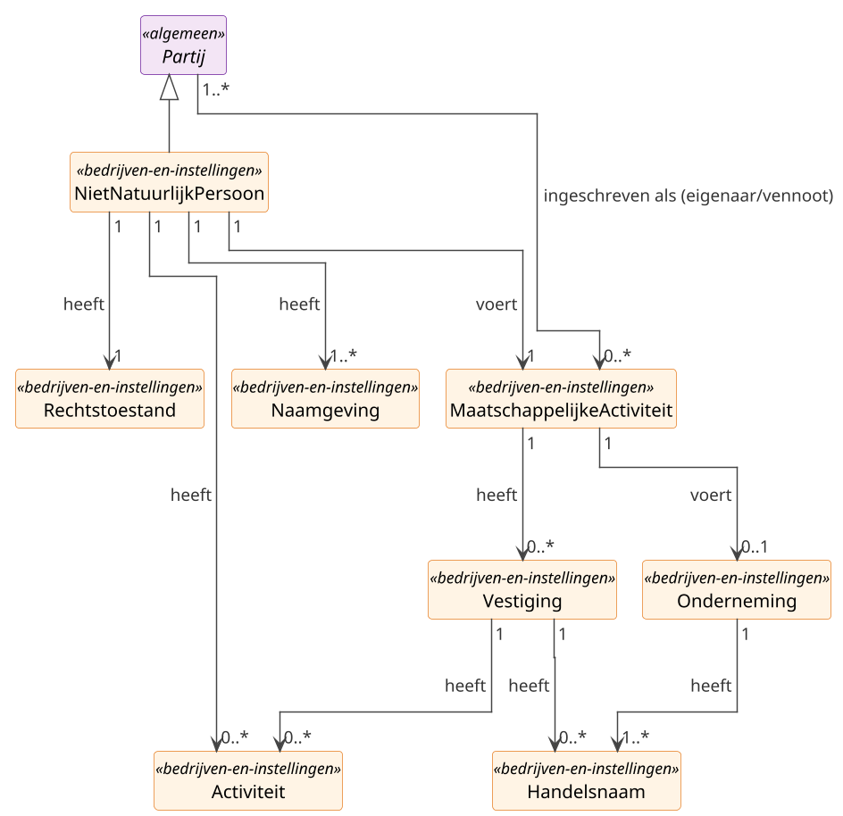

# Deelmodel: Bedrijven en instellingen

Niet-natuurlijke personen zoals ingeschreven in het Handelsregister, met de
keten die daaraan hangt: de maatschappelijke activiteit als drager van het
KVK-nummer, de onderneming als economische eenheid daarbinnen, en de
vestigingen, handelsnamen, statutaire namen, activiteiten en rechtstoestand.

De functionele indeling (bedrijf, overheidsinstelling, maatschappelijke
instelling, buitenlandse entiteit) is een kenmerk dat volgt uit de rechtsvorm,
geen aparte reeks objecttypen.

Natuurlijke personen vallen buiten dit deelmodel; zie
[Personen](personen.md). Het overkoepelende `Partij` staat in het
[hoofdmodel](../hoofdmodel.md).

## Diagram

```plantuml
@startuml
!pragma layout elk

' ---- GBO PlantUML theme ----
skinparam dpi 140
skinparam classAttributeIconSize 0
skinparam shadowing false
skinparam roundCorner 6
skinparam ClassBackgroundColor #FAFAFA
skinparam ClassBorderColor #555555
skinparam ArrowColor #444444
skinparam ArrowFontColor #333333
skinparam NoteBackgroundColor #FFFCD8
skinparam NoteBorderColor #B8B8B8
hide empty members
hide circle

' ---- Deelmodel-kleuren ----
skinparam class<<algemeen>> {
  BackgroundColor #f3e5f5
  BorderColor #6a1b9a
  HeaderBackgroundColor #f3e5f5
}
skinparam class<<personen>> {
  BackgroundColor #e8f0fe
  BorderColor #1967d2
  HeaderBackgroundColor #e8f0fe
}
skinparam class<<bedrijven-en-instellingen>> {
  BackgroundColor #fff4e5
  BorderColor #e67e22
  HeaderBackgroundColor #fff4e5
}
skinparam class<<adressen-en-gebouwen>> {
  BackgroundColor #e8f5e9
  BorderColor #2e7d32
  HeaderBackgroundColor #e8f5e9
}
skinparam class<<onroerende-zaken>> {
  BackgroundColor #fde8d6
  BorderColor #a04000
  HeaderBackgroundColor #fde8d6
}
skinparam class<<waarde-onroerende-zaken>> {
  BackgroundColor #fce4ec
  BorderColor #ad1457
  HeaderBackgroundColor #fce4ec
}
skinparam class<<batch2>> {
  BackgroundColor #eeeeee
  BorderColor #9e9e9e
  HeaderBackgroundColor #eeeeee
}
skinparam class<<mixin>> {
  BackgroundColor #F4F1FF
  BorderColor #7E57C2
  HeaderBackgroundColor #F4F1FF
}
' ---- DIAGRAM-INHOUD HIERONDER ----

abstract class Partij <<algemeen>>

class NietNatuurlijkPersoon <<bedrijven-en-instellingen>>
class MaatschappelijkeActiviteit <<bedrijven-en-instellingen>>
class Onderneming <<bedrijven-en-instellingen>>
class Vestiging <<bedrijven-en-instellingen>>
class Handelsnaam <<bedrijven-en-instellingen>>
class Naamgeving <<bedrijven-en-instellingen>>
class Activiteit <<bedrijven-en-instellingen>>
class Rechtstoestand <<bedrijven-en-instellingen>>

Partij <|-- NietNatuurlijkPersoon

Partij "1..*" --> "0..*" MaatschappelijkeActiviteit : ingeschreven als (eigenaar/vennoot)
NietNatuurlijkPersoon "1" --> "1" MaatschappelijkeActiviteit : voert
NietNatuurlijkPersoon "1" --> "1..*" Naamgeving : heeft
NietNatuurlijkPersoon "1" --> "1" Rechtstoestand : heeft
NietNatuurlijkPersoon "1" --> "0..*" Activiteit : heeft

MaatschappelijkeActiviteit "1" --> "0..1" Onderneming : voert
MaatschappelijkeActiviteit "1" --> "0..*" Vestiging : heeft

Onderneming "1" --> "1..*" Handelsnaam : heeft
Vestiging "1" --> "0..*" Handelsnaam : heeft
Vestiging "1" --> "0..*" Activiteit : heeft

@enduml
```

## Objecttypen

### Activiteit

**Definitie**: Een geregistreerde bedrijfsactiviteit, gecodeerd volgens de
CBS Standaard Bedrijfsindeling (SBI), met onderscheid tussen hoofd- en
nevenactiviteit.

**Herkomst definitie**: Handelsregisterbesluit 2008 art. 11b en 15 lid 1 sub a
(registratie bedrijfsactiviteit); CBS Standaard Bedrijfsindeling (huidig
SBI 2008, opvolger SBI 2025) als classificatiestandaard; KVK Basisprofiel-
en Vestigingsprofiel-API.

**Toelichting**: Een activiteit kan bij een vestiging horen (de uitvoering op
een locatie) of rechtstreeks bij een niet-natuurlijke persoon (een
rechtspersoon die activiteiten registreert zonder een vestiging te voeren).
Per drager geldt op enig moment ten hoogste één activiteit als
hoofdactiviteit; daarnaast nul of meer nevenactiviteiten. SBI-codes komen uit
een externe codelijst van het CBS en zijn versie-gebonden.

**Attribuutsoorten**:

| Naam | Type | Kard. | Toelichting |
|---|---|---|---|
| `sbiCode` | [`Codelijst~CBS_SBI`](../datatypes-en-codelijsten.md#stelselbrede-codelijsten) | 1 | SBI-codering volgens CBS Standaard Bedrijfsindeling. |
| `sbiVersie` | [`Codelijst~CBS_SBI`](../datatypes-en-codelijsten.md#stelselbrede-codelijsten) | 1 | Versie van het SBI-codestelsel; voorkomt verkeerde interpretatie bij revisies (SBI 2008 naar SBI 2025). |
| `omschrijving` | [Tekst](../datatypes-en-codelijsten.md#simpele-datatypes) | 0..1 | Tekstuele toelichting bij de activiteit. |
| `soortActiviteit` | [`SoortActiviteit`](#soortactiviteit) | 1 | Onderscheid tussen hoofd- en nevenactiviteit. |
| `isHoofdactiviteit` | [Indicatie](../datatypes-en-codelijsten.md#simpele-datatypes) | 0..1 | Geeft aan of dit de hoofdactiviteit is; volgt uit `soortActiviteit`. |

### Handelsnaam

**Definitie**: Een naam waaronder een onderneming of een vestiging van een
onderneming naar buiten handelt, met een rangorde en een geldigheidstermijn.

**Herkomst definitie**: Handelsregisterwet 2007 art. 9 sub b en art. 11 lid 1
sub b; Handelsnaamwet. Bij privaatrechtelijke rechtspersonen is de statutaire
naam altijd ook een van de handelsnamen.

**Toelichting**: Een onderneming heeft één of meer handelsnamen; een vestiging
kan daarnaast eigen handelsnamen voeren. Meerdere handelsnamen zijn geordend
via een volgorde, waarbij volgorde 0 de primaire handelsnaam aanduidt. Elke
handelsnaam heeft een eigen periode, zodat historische naamvoering
navolgbaar blijft. De statutaire naam staat niet hier maar bij
[Naamgeving](#naamgeving).

**Attribuutsoorten**:

| Naam | Type | Kard. | Toelichting |
|---|---|---|---|
| `naam` | [Tekst](../datatypes-en-codelijsten.md#simpele-datatypes) | 1 | De handelsnaam zelf. |
| `volgorde` | [Numeriek](../datatypes-en-codelijsten.md#simpele-datatypes) | 0..1 | Rangorde van de handelsnaam; 0 is de primaire handelsnaam. |
| `startdatum` | [Datum](../datatypes-en-codelijsten.md#simpele-datatypes) | 1 | Datum vanaf wanneer de handelsnaam geldt. |
| `einddatum` | [Datum](../datatypes-en-codelijsten.md#simpele-datatypes) | 0..1 | Datum tot wanneer de handelsnaam geldt. |

### MaatschappelijkeActiviteit

**Definitie**: De in het Handelsregister ingeschreven eenheid van een persoon,
drager van het KVK-nummer; het geheel van activiteiten dat onder één
inschrijving wordt gevoerd.

**Herkomst definitie**: Handelsregisterwet 2007 art. 13; KVK-catalogus
("een maatschappelijke activiteit is de activiteit van een natuurlijk of
niet-natuurlijk persoon en is het totaal van alle activiteiten van die
persoon", dus één per persoon). Het KVK-nummer is het identificerende gegeven.

**Toelichting**: De maatschappelijke activiteit is de inschrijvingseenheid die
het KVK-nummer draagt; in de bron valt "de inschrijving" hiermee samen
(alias Inschrijving). Zij hoort één-op-één bij de niet-natuurlijke persoon
die haar voert, kan nul of één onderneming omvatten en draagt de vestigingen.
Continuïteit bij rechtsvormwijziging (eenmanszaak naar BV, fusie, splitsing)
loopt via `Partij`, niet via de maatschappelijke activiteit zelf.

Onderscheid met de onderneming: de maatschappelijke activiteit is de
administratieve inschrijving (het totaal van activiteiten van de persoon);
de onderneming is de economische eenheid daarbinnen. Een maatschappelijke
activiteit kan bestaan zonder onderneming, bijvoorbeeld bij een rechtspersoon
zonder onderneming.

**Attribuutsoorten**:

| Naam | Type | Kard. | Toelichting |
|---|---|---|---|
| `kvkNummer` | [KVKnummer](../datatypes-en-codelijsten.md#aanvullende-datatypes) | 1 | Identificerend gegeven van de inschrijving; 8 cijfers. Canonieke drager van het KVK-nummer. |
| `datumEersteInschrijving` | [Datum](../datatypes-en-codelijsten.md#simpele-datatypes) | 0..1 | Datum waarop de inschrijving voor het eerst bij KVK is geregistreerd. |
| `startdatum` | [DatumIncompleet](../datatypes-en-codelijsten.md#aanvullende-datatypes) | 0..1 | Startdatum van de inschrijving. |
| `einddatum` | [DatumIncompleet](../datatypes-en-codelijsten.md#aanvullende-datatypes) | 0..1 | Einddatum (uitschrijving) van de inschrijving. |
| `documentdatum` | [Datum](../datatypes-en-codelijsten.md#simpele-datatypes) | 0..1 | Datum van de oprichtingsakte of meest recente wijzigingsakte. |
| `documentnummer` | [Identificatie](../datatypes-en-codelijsten.md#simpele-datatypes) | 0..1 | Akte-nummer van de oprichtings- of wijzigingsakte. |
| `naam` | [Tekst](../datatypes-en-codelijsten.md#simpele-datatypes) | 0..1 | Naam of eerste handelsnaam van de inschrijving; volgt uit de naamgeving of de handelsnaam van de hoofdvestiging. |
| `nonMailing` | [Indicatie](../datatypes-en-codelijsten.md#simpele-datatypes) | 0..1 | Geeft aan of de adresgegevens niet voor mailing-doeleinden beschikbaar worden gesteld. |

**Relaties**:

| Relatie | Doel | Kard. | Toelichting |
|---|---|---|---|
| voert | [Onderneming](#onderneming) | 1 → 0..1 | De economische onderneming binnen deze inschrijving, indien aanwezig. |
| heeft | [Vestiging](#vestiging) | 1 → 0..* | De vestigingen onder deze inschrijving, waaronder ten hoogste één hoofdvestiging op enig moment. |

### Naamgeving

**Definitie**: De statutaire naam en alternatieve benamingen van een
niet-natuurlijke persoon, elk met een eigen geldigheidstermijn.

**Herkomst definitie**: Handelsregisterwet 2007 art. 11 lid 1 sub b
(naamregistratie); KVK Naamgeving-API.

**Toelichting**: Naamgeving draagt de statutaire naam (bij geregistreerde
statuten), de werknaam en alternatieve benamingen zoals `ookGenoemd` voor
verenigingen en stichtingen. Geldigheidsperiodes per naamrepresentatie maken
historische naamvoering navolgbaar. Handelsnamen horen niet hier maar bij de
onderneming en de vestiging; zie [Handelsnaam](#handelsnaam).

**Attribuutsoorten**:

| Naam | Type | Kard. | Toelichting |
|---|---|---|---|
| `statutaireNaam` | [Tekst](../datatypes-en-codelijsten.md#simpele-datatypes) | 0..1 | Naam zoals vastgelegd in de geregistreerde statuten. |
| `naam` | [Tekst](../datatypes-en-codelijsten.md#simpele-datatypes) | 1 | Naam van de rechtspersoon, het samenwerkingsverband of de niet-commerciële vestiging. |
| `ookGenoemd` | [Tekst](../datatypes-en-codelijsten.md#simpele-datatypes) | 0..1 | Alternatieve benaming, bij vereniging of stichting. |
| `startdatum` | [Datum](../datatypes-en-codelijsten.md#simpele-datatypes) | 1 | Datum vanaf wanneer deze naamrepresentatie geldt. |
| `einddatum` | [Datum](../datatypes-en-codelijsten.md#simpele-datatypes) | 0..1 | Datum tot wanneer deze naamrepresentatie geldt. |

### NietNatuurlijkPersoon

**Definitie**: Een organisatie of rechtsfiguur, geen mens, die als
rechtsdragend subject kan deelnemen aan rechtsbetrekkingen. Omvat
rechtspersonen (BV, NV, stichting, vereniging, coöperatie, publiekrechtelijke
rechtspersoon, kerkgenootschap), entiteiten zonder eigen
rechtspersoonlijkheid (eenmanszaak, VOF, CV, maatschap) en buitenlandse
entiteiten met activiteit in Nederland.

**Herkomst definitie**: Burgerlijk Wetboek boek 2 (rechtspersonen);
Handelsregisterwet 2007 art. 10 lid 3 en 12 (RSIN); stelselcatalogus
("een niet-natuurlijk persoon is een persoon met rechten en plichten die geen
natuurlijk persoon is"); semantische verbreding zodat ook entiteiten zonder
rechtspersoonlijkheid en overheidsorganen buiten KVK-scope onder dit type
vallen.

**Toelichting**: De niet-natuurlijke persoon is één concreet type. De
functionele indeling (bedrijf, overheidsinstelling, maatschappelijke
instelling, buitenlandse entiteit) is geen aparte reeks typen maar het
kenmerk `classificatie`, dat volgt uit de rechtsvorm. Reden: die indeling is
geen zelfstandig gegeven in het Handelsregister en zou anders dubbelzinnig
worden, bijvoorbeeld bij een vereniging die commercieel handelt. Door de
indeling uit de rechtsvorm te bepalen en het feit "voert een onderneming"
apart vast te leggen in `heeftOnderneming`, blijft elke entiteit eenduidig te
plaatsen.

Een niet-natuurlijke persoon heeft precies één eigen inschrijving. Het
KVK-nummer is daarmee enkelvoudig beschikbaar via de maatschappelijke
activiteit; het RSIN is de eigen identificatie. De keuze voor
*niet-natuurlijke persoon* boven *rechtspersoon* is principieel:
rechtspersoonlijkheid is geen vereiste om als wederpartij op te treden. Een
VOF heeft geen rechtspersoonlijkheid maar wel RSIN, KVK-nummer en
vestigingen; een eenmanszaak eveneens. De eenmanszaak wordt daarom als
niet-natuurlijke persoon gemodelleerd (rechtsvorm eenmanszaak), niet als
natuurlijke persoon met onderneming, zodat KVK-administratie en
contractpartij-registratie aansluiten op de praktijk van het Handelsregister.

**Attribuutsoorten**:

| Naam | Type | Kard. | Toelichting |
|---|---|---|---|
| `rsin` | [Tekst](../datatypes-en-codelijsten.md#simpele-datatypes) | 0..1 | Rechtspersonen- en Samenwerkingsverbanden Identificatie Nummer; de eigen fiscale identificatie; 9 cijfers. |
| `kvkNummer` | [KVKnummer](../datatypes-en-codelijsten.md#aanvullende-datatypes) | 0..1 | KVK-nummer, beschikbaar via de eigen maatschappelijke activiteit. |
| `rechtsvorm` | [`Codelijst~KVK_Rechtsvorm`](#codelijsten) | 1 | Juridische vorm volgens de KVK-rechtsvormtabel. |
| `rechtsvormOmschrijving` | [Tekst](../datatypes-en-codelijsten.md#simpele-datatypes) | 0..1 | Aanduiding van de rechtsvorm in vrije tekst wanneer geen codelijst-waarde bestaat. |
| `classificatie` | [`NietNatuurlijkPersoonClassificatie`](#nietnatuurlijkpersoonclassificatie) | 1 | Functionele indeling (bedrijf, overheidsinstelling, maatschappelijke instelling, buitenlandse entiteit, overige); volgt uit de rechtsvorm. |
| `heeftOnderneming` | [Indicatie](../datatypes-en-codelijsten.md#simpele-datatypes) | 0..1 | Geeft aan of de entiteit een onderneming voert. Benaderend kenmerk: het onderliggende oordeel is materieel en peildatum-afhankelijk, geen hard gegeven uit de bron. |
| `naam` | [Tekst](../datatypes-en-codelijsten.md#simpele-datatypes) | 1 | Werknaam; bij rechtspersonen met statuten gelijk aan de statutaire naam. De gezaghebbende naamlagen staan bij [Naamgeving](#naamgeving). |
| `zetel` | [Tekst](../datatypes-en-codelijsten.md#simpele-datatypes) | 0..1 | Statutaire vestigingsplaats. |
| `hoofdSbiCode` | [`Codelijst~CBS_SBI`](../datatypes-en-codelijsten.md#stelselbrede-codelijsten) | 0..1 | SBI-hoofdactiviteit; samenvatting, canoniek op de onderneming. |
| `herkomst` | [`Herkomst`](#herkomst) | 1 | Binnen- of buitenlandse herkomst; volgt uit rechtsvorm en land van oprichting. |
| `aansprakelijkheid` | [`Aansprakelijkheid`](#aansprakelijkheid) | 1 | Aansprakelijkheidskarakter; volgt uit de rechtsvorm. |
| `typeOverheid` | [`TypeOverheid`](#typeoverheid) | 0..1 | Bestuurlijke typering, bij een overheidsinstelling. Externe verrijking: niet uit het Handelsregister af te leiden. |
| `bevoegdGezagCode` | [`Codelijst~TOOI`](../datatypes-en-codelijsten.md#stelselbrede-codelijsten) | 0..1 | Koppeling naar het TOOI-register, bij een overheidsinstelling. Externe verrijking; niet elke overheidsinstelling staat in TOOI. |
| `typeMaatschappelijk` | [`TypeMaatschappelijk`](#typemaatschappelijk) | 0..1 | Sectorale typering, bij een maatschappelijke instelling. Externe verrijking via sectorregisters. |
| `anbiStatus` | [Indicatie](../datatypes-en-codelijsten.md#simpele-datatypes) | 0..1 | ANBI-erkenning door de Belastingdienst; fiscaal relevant voor giften en vrijstellingen. |
| `landVanOprichting` | [`Codelijst~ISO3166`](../datatypes-en-codelijsten.md#stelselbrede-codelijsten) | 0..1 | Land waarin de entiteit is opgericht, bij een buitenlandse entiteit. |
| `rechtsvormBuitenland` | [Tekst](../datatypes-en-codelijsten.md#simpele-datatypes) | 0..1 | Buitenlandse juridische vorm in vrije tekst; geen Nederlandse codelijst beschikbaar. |

**Relaties**:

| Relatie | Doel | Kard. | Toelichting |
|---|---|---|---|
| voert | [MaatschappelijkeActiviteit](#maatschappelijkeactiviteit) | 1 → 1 | De eigen inschrijving in het Handelsregister; één per niet-natuurlijke persoon. |
| heeft | [Naamgeving](#naamgeving) | 1 → 1..* | Statutaire naam en alternatieve benamingen, met geldigheidsperiode. |
| heeft | [Rechtstoestand](#rechtstoestand) | 1 → 1 | Actuele juridische en administratieve status. |
| heeft | [Activiteit](#activiteit) | 1 → 0..* | SBI-gecodeerde activiteiten van een rechtspersoon zonder vestiging. |

Aan de rolzijde is een niet-natuurlijke persoon via `Partij` ook als
eigenaar of vennoot bij één of meer inschrijvingen betrokken; dat loopt via
de rol-relatie op `Partij`, niet via de eigen identiteit.

### Onderneming

**Definitie**: Een voldoende zelfstandig optredende organisatorische eenheid
waarin door inbreng van arbeid of middelen goederen of diensten aan derden
worden geleverd met het oogmerk materieel voordeel te behalen.

**Herkomst definitie**: Handelsregisterbesluit 2008 art. 2 (ondernemingsbegrip);
Handelsregisterwet 2007 art. 5; Beleidsregel ondernemingsbegrip in het
Handelsregister.

**Toelichting**: De onderneming is de economische eenheid binnen een
maatschappelijke activiteit. Zij heeft geen eigen KVK-nummer in de bron (dat
staat op de maatschappelijke activiteit) en krijgt daarom een GBO-eigen
identificatie, omdat één KVK-nummer meerdere onderscheiden ondernemingen kan
dekken. Onderscheid met de activiteit: de onderneming is de onderneming als
geheel (bijvoorbeeld de viskraam-onderneming), een activiteit is een
SBI-gecodeerde deelactiviteit (bijvoorbeeld 46.38.1 Detailhandel in vis).

**Attribuutsoorten**:

| Naam | Type | Kard. | Toelichting |
|---|---|---|---|
| `identificatie` | [UUID](../datatypes-en-codelijsten.md#aanvullende-datatypes) | 1 | GBO-eigen sleutel; geen externe identificatie in het Handelsregister voor de onderneming als eenheid binnen een inschrijving. |
| `kvkNummer` | [KVKnummer](../datatypes-en-codelijsten.md#aanvullende-datatypes) | 0..1 | KVK-nummer van de omvattende inschrijving. |
| `startdatum` | [Datum](../datatypes-en-codelijsten.md#simpele-datatypes) | 0..1 | Aanvangsdatum van de onderneming. |
| `einddatum` | [Datum](../datatypes-en-codelijsten.md#simpele-datatypes) | 0..1 | Beëindigingsdatum; open zolang de onderneming actief is. |
| `hoofdSbiCode` | [`Codelijst~CBS_SBI`](../datatypes-en-codelijsten.md#stelselbrede-codelijsten) | 0..1 | SBI van de hoofdactiviteit van deze onderneming; canoniek op de onderneming. |
| `omschrijving` | [Tekst](../datatypes-en-codelijsten.md#simpele-datatypes) | 0..1 | Korte beschrijving van de ondernemings-activiteit. |

**Relaties**:

| Relatie | Doel | Kard. | Toelichting |
|---|---|---|---|
| heeft | [Handelsnaam](#handelsnaam) | 1 → 1..* | Eén of meer handelsnamen waaronder de onderneming naar buiten treedt. |

### Rechtstoestand

**Definitie**: De juridische en administratieve status van een
niet-natuurlijke persoon: of zij actief is, of er een insolventie-omstandigheid
geldt en of de entiteit is ontbonden.

**Herkomst definitie**: Handelsregisterwet 2007 en Faillissementswet
(registratie van faillissement en surseance van betaling); KVK
Basisprofiel-API voor de statusvelden.

**Toelichting**: Rechtstoestand bundelt statusvelden die samenhoren. Precies
één rechtstoestand per niet-natuurlijke persoon geeft het actuele beeld;
historie loopt via de tijdregistratie. Een insolventie is getypeerd naar aard
(faillissement of surseance van betaling) en naar status (voorlopig of
definitief), wat juridisch bepalend is: een voorlopige surseance heeft andere
rechtsgevolgen dan een definitieve. Schuldsanering (WSNP) geldt alleen voor
natuurlijke personen en valt buiten dit deelmodel.

**Attribuutsoorten**:

| Naam | Type | Kard. | Toelichting |
|---|---|---|---|
| `actief` | [Indicatie](../datatypes-en-codelijsten.md#simpele-datatypes) | 1 | Geeft aan of de inschrijving actief is. |
| `soortInsolventie` | [`SoortInsolventie`](#soortinsolventie) | 0..1 | Aard van de insolventie-omstandigheid (faillissement, surseance van betaling). |
| `insolventieStatus` | [`StatusInsolventie`](#statusinsolventie) | 0..1 | Voorlopige of definitieve status van de insolventie. |
| `datumInsolventie` | [Datum](../datatypes-en-codelijsten.md#simpele-datatypes) | 0..1 | Ingangsdatum van de insolventie-omstandigheid. |
| `ontbonden` | [Indicatie](../datatypes-en-codelijsten.md#simpele-datatypes) | 1 | Geeft aan of de entiteit is ontbonden. |

### Vestiging

**Definitie**: Een fysieke of functionele locatie waar onder een inschrijving
activiteiten worden uitgevoerd, geïdentificeerd door een vestigingsnummer en
optioneel gekoppeld aan een adresseerbaar object in de BAG.

**Herkomst definitie**: Handelsregisterwet 2007 art. 11 en 14 (vestiging als
gebouw of complex van gebouwen waar duurzame uitoefening van activiteiten
plaatsvindt); KVK Vestigingsprofiel-API; BAG-koppeling via NEN
3610-identificatie.

**Toelichting**: Een vestiging hoort bij een maatschappelijke activiteit: die
heeft nul of meer vestigingen, waarvan ten hoogste één hoofdvestiging op enig
moment. Adres-koppeling loopt via `adresseerbaarObjectId` naar het deelmodel
[Adressen en gebouwen](adressen-en-gebouwen.md); de vestiging zelf bevat geen
adres-kenmerken. Activiteiten op vestigingsniveau lopen via de relatie naar
[Activiteit](#activiteit). Verleden waarden van een vestiging worden over de
tijd bewaard, zodat verhuizing en typering navolgbaar zijn.

**Attribuutsoorten**:

| Naam | Type | Kard. | Toelichting |
|---|---|---|---|
| `vestigingsnummer` | [Vestigingsnummer](../datatypes-en-codelijsten.md#aanvullende-datatypes) | 1 | Primaire identificatie van de vestiging; 12 cijfers. |
| `typeVestiging` | [`TypeVestiging`](#typevestiging) | 1 | Onderscheid hoofd- en nevenvestiging; ten hoogste één hoofdvestiging per inschrijving op enig moment. |
| `datumAanvang` | [DatumIncompleet](../datatypes-en-codelijsten.md#aanvullende-datatypes) | 1 | Startdatum van de vestiging. |
| `datumEinde` | [DatumIncompleet](../datatypes-en-codelijsten.md#aanvullende-datatypes) | 0..1 | Einddatum van de vestiging. |
| `adresseerbaarObjectId` | [BAGID](../datatypes-en-codelijsten.md#aanvullende-datatypes) | 0..1 | Koppeling naar het adresseerbaar object in de BAG; geen Nederlands adres betekent geen identificatie. |

**Relaties**:

| Relatie | Doel | Kard. | Toelichting |
|---|---|---|---|
| heeft | [Handelsnaam](#handelsnaam) | 1 → 0..* | Vestiging-specifieke handelsnamen, met volgorde en geldigheidsperiode. |
| heeft | [Activiteit](#activiteit) | 1 → 0..* | Locatie-specifieke SBI-uitvoering per vestiging. |

## Enumeraties

### Aansprakelijkheid

**Definitie**: Aanduiding van het aansprakelijkheidskarakter dat voor een
rechtsvorm geldt: in welke mate eigenaren, bestuurders of vennoten persoonlijk
instaan voor verplichtingen van de entiteit.

**Herkomst definitie**: Burgerlijk Wetboek boek 2 (rechtspersonen, beperkte
aansprakelijkheid) en boek 7A (personenvennootschappen, hoofdelijke en
onbeperkte aansprakelijkheid); GBO-classificatie afgeleid uit de
rechtsvorm-codelijst.

**Toelichting**: Het kenmerk vat de rechtsvorm samen in vier brede klassen.
Het ondersteunt vragen rond kredietrisico, contractering en publieke
aansprakelijkheid zonder dat afnemers de volledige rechtsvorm-codelijst hoeven
te interpreteren.

**Gebruikt door**: `NietNatuurlijkPersoon.aansprakelijkheid`.

**Waarden**:

| Naam | Definitie | Toelichting |
|---|---|---|
| Beperkt | Aansprakelijkheid is beperkt tot het in de entiteit ingebrachte vermogen. | Typisch voor BV, NV, coöperatie. |
| Onbeperkt | Eigenaar staat met het volledige privévermogen in voor verplichtingen. | Typisch voor eenmanszaak. |
| Hoofdelijk | Vennoten zijn ieder voor het geheel aansprakelijk voor verplichtingen van de entiteit. | Typisch voor VOF en maatschap. |
| Publiek | Aansprakelijkheid valt onder publiekrechtelijk regime, doorgaans met overheidsgarantie. | Typisch voor publiekrechtelijke rechtspersonen. |

### Herkomst

**Definitie**: Aanduiding of een niet-natuurlijke persoon van Nederlandse of
buitenlandse herkomst is, gemeten naar de plaats van oprichting of statutaire
zetel.

**Herkomst definitie**: GBO-classificatie, afgeleid uit de rechtsvorm (een
buitenlandse rechtsvorm levert buitenland) en uit het land van oprichting.

**Toelichting**: Het kenmerk maakt filteren op binnenlandse versus
buitenlandse wederpartij mogelijk zonder dat afnemers de volledige rechtsvorm
hoeven te kennen.

**Gebruikt door**: `NietNatuurlijkPersoon.herkomst`.

**Waarden**:

| Naam | Definitie | Toelichting |
|---|---|---|
| Binnenland | Entiteit met statutaire zetel in Nederland. | Standaard voor binnenlandse rechtsvormen. |
| Buitenland | Entiteit met statutaire zetel buiten Nederland. | Valt samen met classificatie buitenlandse entiteit. |

### NietNatuurlijkPersoonClassificatie

**Definitie**: Functionele indeling van een niet-natuurlijke persoon, bepaald
uit de rechtsvorm.

**Herkomst definitie**: GBO-classificatie, bepaald uit de KVK-rechtsvorm.

**Toelichting**: De indeling is een queryable kenmerk op de rechtsvorm; het
feit of de entiteit commercieel handelt staat los daarvan in
`heeftOnderneming`. Zo landt een commercieel handelende vereniging eenduidig
als maatschappelijke instelling, met `heeftOnderneming` op Ja.

**Gebruikt door**: `NietNatuurlijkPersoon.classificatie`.

**Waarden**:

| Naam | Definitie | Toelichting |
|---|---|---|
| Bedrijf | Commerciële entiteit. | BV, NV, coöperatie, OWM, eenmanszaak, VOF, CV, maatschap, EESV, SE, SCE. |
| Overheidsinstelling | Publiekrechtelijke rechtspersoon met publieke taak. | Bepaald uit een publiekrechtelijke rechtsvorm. |
| MaatschappelijkeInstelling | Privaatrechtelijke non-profit-entiteit. | Stichting, vereniging, kerkgenootschap, VvE, overige niet-commerciële privaatrechtelijke rechtsvorm. |
| BuitenlandseEntiteit | Entiteit met een buitenlandse rechtsvorm en activiteit in Nederland. | Herkomst weegt zwaarst: een buitenlandse rechtsvorm. |
| Overige | Restcategorie voor entiteiten zonder codelijst-waarde of die niet elders landen. | Voor vrije-tekst-rechtsvorm en grensgevallen. |

### SoortActiviteit

**Definitie**: Aanduiding of een geregistreerde activiteit een hoofd- of
nevenactiviteit is binnen de vestiging of rechtspersoon waarop zij is
vastgelegd.

**Herkomst definitie**: Handelsregisterbesluit 2008 art. 11b en 15 lid 1 sub a
(registratie van hoofd- en nevenactiviteit); KVK Basisprofiel- en
Vestigingsprofiel-API.

**Toelichting**: Per drager is op enig moment ten hoogste één activiteit met
Hoofd toegestaan; nul of meer met Neven. Het kenmerk `isHoofdactiviteit` op
Activiteit volgt uit deze waarde.

**Gebruikt door**: `Activiteit.soortActiviteit`.

**Waarden**:

| Naam | Definitie | Toelichting |
|---|---|---|
| Hoofd | Activiteit die als hoofdactiviteit op de drager geldt. | Ten hoogste één per drager op enig moment. |
| Neven | Activiteit die naast de hoofdactiviteit op de drager geldt. | Nul of meer per drager. |

### SoortInsolventie

**Definitie**: Aard van een in het Handelsregister geregistreerde
insolventie-omstandigheid van een niet-natuurlijke persoon.

**Herkomst definitie**: Faillissementswet (faillissement, surseance van
betaling); KVK-catalogus soort bijzondere rechtstoestand.

**Toelichting**: Alleen de voor niet-natuurlijke personen relevante vormen.
Schuldsanering (WSNP) is natuurlijk-persoon-specifiek en valt buiten dit
deelmodel.

**Gebruikt door**: `Rechtstoestand.soortInsolventie`.

**Waarden**:

| Naam | Definitie | Toelichting |
|---|---|---|
| Faillissement | Gerechtelijk beslag op en vereffening van het gehele vermogen van de schuldenaar. | |
| SurseanceVanBetaling | Gerechtelijk verleend uitstel van betaling. | |

### StatusInsolventie

**Definitie**: Status van een insolventie-omstandigheid: voorlopig of
definitief.

**Herkomst definitie**: Faillissementswet; KVK-catalogus status insolventie.

**Toelichting**: Juridisch bepalend; een voorlopige omstandigheid heeft andere
rechtsgevolgen dan een definitieve.

**Gebruikt door**: `Rechtstoestand.insolventieStatus`.

**Waarden**:

| Naam | Definitie | Toelichting |
|---|---|---|
| Voorlopig | Voorlopig uitgesproken omstandigheid. | |
| Definitief | Definitief uitgesproken omstandigheid. | |

### TypeMaatschappelijk

**Definitie**: Sectorale typering van een maatschappelijke instelling: het
maatschappelijke veld waarin zij hoofdzakelijk werkzaam is.

**Herkomst definitie**: GBO-classificatie, gebaseerd op de gangbare sectorale
indeling van privaatrechtelijke non-profit-entiteiten (onderwijs, zorg,
welzijn, religie, sport en cultuur, brancheorganisaties).

**Toelichting**: Externe verrijking, niet uit het Handelsregister af te
leiden; verrijking via sectorregisters. Een entiteit valt op enig moment in
precies één categorie.

**Gebruikt door**: `NietNatuurlijkPersoon.typeMaatschappelijk`.

**Waarden**:

| Naam | Definitie | Toelichting |
|---|---|---|
| Onderwijs | Instelling werkzaam in onderwijs of onderwijsondersteuning. | School, hogeschool, universiteit, onderwijskoepel. |
| Zorg | Instelling werkzaam in gezondheidszorg, jeugdzorg of langdurige zorg. | Ziekenhuis, GGZ, thuiszorg. |
| Religie | Instelling met religieus of levensbeschouwelijk doel. | Kerkgenootschap, geloofsgemeenschap. |
| Sport_Cultuur | Instelling werkzaam in sport, kunst of cultuur. | Sportvereniging, museum, theater. |
| Welzijn | Instelling werkzaam in welzijn, maatschappelijke ondersteuning of armoedebestrijding. | Voedselbank, buurthuis, jeugdwerk. |
| BrancheBelangen | Instelling die belangen behartigt van een branche of beroepsgroep. | Brancheorganisatie, vakbond. |
| OverigMaatschappelijk | Overige maatschappelijke instelling die niet onder de overige typen valt. | Restcategorie. |

### TypeOverheid

**Definitie**: Bestuurlijke typering van een overheidsinstelling: het
bestuurlijke niveau of de bestuursvorm waaraan zij toebehoort.

**Herkomst definitie**: Organieke wetgeving (Grondwet, Gemeentewet,
Provinciewet, Waterschapswet); Kaderwet zelfstandige bestuursorganen;
TOOI-register als operationele referentie.

**Toelichting**: Externe verrijking, niet uit het Handelsregister af te
leiden. De waarden volgen de bestuurlijke lagen plus de twee
verzelfstandigingsvormen. ZBO en RWT zijn gescheiden (Kaderwet zelfstandige
bestuursorganen tegenover rechtspersoon met een wettelijke taak).

**Gebruikt door**: `NietNatuurlijkPersoon.typeOverheid`.

**Waarden**:

| Naam | Definitie | Toelichting |
|---|---|---|
| Rijksoverheid | Centrale overheid als geheel. | Voor overkoepelende rijksentiteiten. |
| Ministerie | Departement van de Rijksoverheid. | Twaalf ministeries plus AZ. |
| Provincie | Provinciaal bestuur. | Twaalf provincies. |
| Gemeente | Gemeentelijk bestuur. | Alle Nederlandse gemeenten. |
| Waterschap | Functioneel bestuur voor waterbeheer. | Eenentwintig waterschappen. |
| ZBO | Zelfstandig bestuursorgaan. | Bestuurlijk verzelfstandigd bestuursorgaan (Kaderwet zelfstandige bestuursorganen). |
| RWT | Rechtspersoon met een wettelijke taak. | Publieke taak zonder ZBO-status. |
| Agentschap | Uitvoeringsorganisatie binnen een ministerie met eigen baten-lasten-administratie. | Bijvoorbeeld Rijkswaterstaat, RVO. |
| OverigeOverheid | Overige publiekrechtelijke entiteit die niet onder de overige typen valt. | Restcategorie. |

### TypeVestiging

**Definitie**: Onderscheid tussen hoofd- en nevenvestiging binnen een
inschrijving in het Handelsregister.

**Herkomst definitie**: Handelsregisterwet 2007 art. 11 en 14
(vestigingsregistratie); KVK Vestigingsprofiel-API.

**Toelichting**: Per inschrijving geldt op enig moment ten hoogste één
vestiging als hoofdvestiging; alle overige vestigingen zijn nevenvestiging.

**Gebruikt door**: `Vestiging.typeVestiging`.

**Waarden**:

| Naam | Definitie | Toelichting |
|---|---|---|
| Hoofdvestiging | Vestiging die binnen een inschrijving als hoofdvestiging is aangewezen. | Ten hoogste één per inschrijving op enig moment. |
| Nevenvestiging | Vestiging die binnen een inschrijving naast de hoofdvestiging bestaat. | Nul of meer per inschrijving. |

## Codelijsten

Deelmodel-specifieke codelijsten. Stelselbrede codelijsten (CBS SBI voor
bedrijfsindeling, TOOI voor overheidsorganisaties, ISO 3166 voor het land van
een buitenlandse entiteit) staan op de
[Datatypes en codelijsten](../datatypes-en-codelijsten.md).

De KVK-rechtsvormen worden beheerd door de
[Kamer van Koophandel](https://www.kvk.nl/) en zijn raadpleegbaar via het
[KVK Developer Portal](https://developers.kvk.nl/) (basisprofiel-API, attribuut
`materieleRegistratie.rechtsvorm`) en de KVK Gegevenscatalogus.

| Codelijst | Bron / beheerder | GBO-typering | Gebruikt door |
|---|---|---|---|
| [KVK Rechtsvormen](https://developers.kvk.nl/) | [KVK](https://www.kvk.nl/) | `Codelijst~KVK_Rechtsvorm` | `NietNatuurlijkPersoon.rechtsvorm`. Eén gedeelde codelijst die de rechtspersoon-, samenwerkingsverband-, publiekrechtelijke, overige privaatrechtelijke en buitenlandse rechtsvormen omvat. De classificatie volgt hieruit. |

### Onderhoudsritme

| Codelijst | Mutatieritme | Bron |
|---|---|---|
| [KVK Rechtsvormen](https://developers.kvk.nl/) | Per wijziging [Handelsregisterwet 2007](https://wetten.overheid.nl/BWBR0021777) of Boek 2 BW | [KVK Developer Portal](https://developers.kvk.nl/) |

## Stelselkoppelingen

- → [Adressen en gebouwen](adressen-en-gebouwen.md):
  `Vestiging bezoekadres Binnenlandsadres` (via `adresseerbaarObjectId`).
- → [Personen](personen.md): gedeeld via het overkoepelende `Partij`.
- → [Onroerende zaken](onroerende-zaken.md): `NietNatuurlijkPersoon` is via
  `Tenaamstelling` tenaamgesteld op `ZakelijkRecht`.

## Bron

Autoritatieve bron: **Handelsregister**, beheerd door de Kamer van Koophandel
(KVK). Juridische basis: Handelsregisterwet 2007 en Handelsregisterbesluit
2008. Het Handelsregister-datamodel is niet publiek als zelfstandig
modeldocument; het is reconstrueerbaar uit de KVK Developer Portal (Zoeken,
Basisprofiel, Vestigingsprofiel, Naamgeving, Mutatieservice) en de KVK
Gegevenscatalogus. Er is geen Haal Centraal API voor het Handelsregister.
</content>
</invoke>
