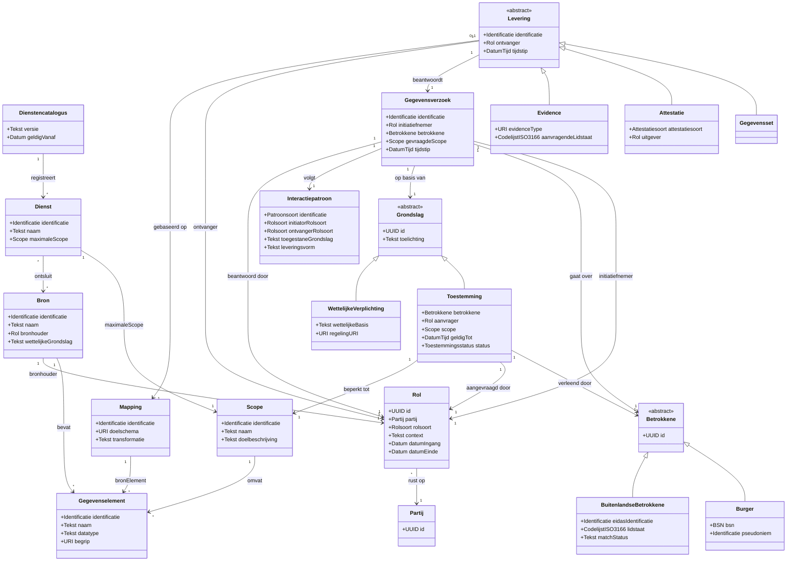

# GBO-Voorzieningenmodel

Het voorzieningenmodel beschrijft de **uitwisseling**: wie vraagt gegevens op, op
welke juridische grondslag, en wat er teruggeleverd wordt. Het staat naast het
inhoudelijke kernmodel, dat beschrijft *welke* gegevens er in de registraties
zitten. De canonieke bron is het LinkML-schema `voorzieningen.yaml`, in de
modelbron onder `publicatie/linkml/` en gepubliceerd onder
`v0.4/informatiemodel/linkml/`.

Het model heeft een **eigen ontologie-namespace**,
`https://lod.gbo-semantiek.nl/voorzieningen/` (prefix `gbovz:`), en wordt als
eigen artefact gepubliceerd: `GBO-Voorzieningen.ttl` en
`GBO-Voorzieningen-Shapes.ttl`. De klassen verwijzen via `skos:exactMatch` naar
hun begrip in het begrippenkader; ontologie en begrippenkader blijven zo
gescheiden documenten.

!!! info "Afbakening"
    Begrippen (definities, labels, relaties tussen termen) worden niet hier
    beheerd maar in het begrippenkader. Elk objecttype verwijst via
    `exact_mappings` naar precies een begrip.

---

## Uitgangspunt: kanaal-neutraliteit

De [GBO PSA](https://ictu.github.io/GBO-PSA/main/interactiepatronen/) onderscheidt
drie interactiepatronen. Het model moet alle drie kunnen dragen zonder dat een
van de drie in de structuur is ingebakken.

| Patroon | Initiator | Ontvanger | Grondslag | Leveringsvorm |
|---|---|---|---|---|
| Wallet-attestatie | Betrokkene | Betrokkene (wallet) | Toestemming | Attestatie (PubEAA of QEAA) |
| OOTS-evidence | EU-overheidsdienst | EU-overheidsdienst | Wettelijke verplichting | Evidence |
| Toestemming private partij | Dienstverlener | Dienstverlener | Toestemming | Gegevensset |

Drie ontwerpkeuzes volgen hieruit:

1. **Wie initieert, is een rol en geen vast objecttype.** Een `Gegevensverzoek`
   verwijst naar een `Rol`, niet naar een `Dienstverlener`. Daarmee kan de
   betrokkene zelf, een dienstverlener of een EU-overheidsdienst het verzoek
   starten.
2. **Toestemming is een soort grondslag, niet de grondslag.** `Grondslag` is het
   supertype; `Toestemming` en `WettelijkeVerplichting` zijn de twee vormen. Een
   verzoek verwijst naar precies een grondslag.
3. **Wat geleverd wordt, is een eigen objecttype.** `Levering` met `Gegevensset`,
   `Attestatie` en `Evidence` als subtypes, plus een `Mapping` die vastlegt hoe
   brongegevens naar de leveringsvorm zijn omgezet.

Een nieuw kanaal is daarmee een nieuw voorkomen van `Interactiepatroon` en geen
modelwijziging.

---

## Objecttypen en relaties

```mermaid
classDiagram
    class Partij {
        +UUID id
    }

    class Rol {
        +UUID id
        +Partij partij
        +Rolsoort rolsoort
        +Tekst context
        +Datum datumIngang
        +Datum datumEinde
    }

    class Betrokkene {
        <<abstract>>
        +UUID id
    }

    class Burger {
        +BSN bsn
        +Identificatie pseudoniem
    }

    class BuitenlandseBetrokkene {
        +Identificatie eidasIdentificatie
        +CodelijstISO3166 lidstaat
        +Tekst matchStatus
    }

    class Grondslag {
        <<abstract>>
        +UUID id
        +Tekst toelichting
    }

    class Toestemming {
        +Betrokkene betrokkene
        +Rol aanvrager
        +Scope scope
        +DatumTijd geldigTot
        +Toestemmingsstatus status
    }

    class WettelijkeVerplichting {
        +Tekst wettelijkeBasis
        +URI regelingURI
    }

    class Gegevenselement {
        +Identificatie identificatie
        +Tekst naam
        +Tekst datatype
        +URI begrip
    }

    class Bron {
        +Identificatie identificatie
        +Tekst naam
        +Rol bronhouder
        +Tekst wettelijkeGrondslag
    }

    class Dienst {
        +Identificatie identificatie
        +Tekst naam
        +Scope maximaleScope
    }

    class Scope {
        +Identificatie identificatie
        +Tekst naam
        +Tekst doelbeschrijving
    }

    class Dienstencatalogus {
        +Tekst versie
        +Datum geldigVanaf
    }

    class Interactiepatroon {
        +Patroonsoort identificatie
        +Rolsoort initiatorRolsoort
        +Rolsoort ontvangerRolsoort
        +Tekst toegestaneGrondslag
        +Tekst leveringsvorm
    }

    class Gegevensverzoek {
        +Identificatie identificatie
        +Rol initiatiefnemer
        +Betrokkene betrokkene
        +Scope gevraagdeScope
        +DatumTijd tijdstip
    }

    class Levering {
        <<abstract>>
        +Identificatie identificatie
        +Rol ontvanger
        +DatumTijd tijdstip
    }

    class Gegevensset
    class Attestatie {
        +Attestatiesoort attestatiesoort
        +Rol uitgever
    }
    class Evidence {
        +URI evidenceType
        +CodelijstISO3166 aanvragendeLidstaat
    }

    class Mapping {
        +Identificatie identificatie
        +URI doelschema
        +Tekst transformatie
    }

    Betrokkene <|-- Burger
    Betrokkene <|-- BuitenlandseBetrokkene
    Grondslag <|-- Toestemming
    Grondslag <|-- WettelijkeVerplichting
    Levering <|-- Gegevensset
    Levering <|-- Attestatie
    Levering <|-- Evidence

    Rol "*" --> "1" Partij : rust op
    Bron "1" --> "*" Gegevenselement : bevat
    Bron "1" --> "1" Rol : bronhouder
    Dienst "1" --> "1" Scope : maximaleScope
    Dienst "*" --> "*" Bron : ontsluit
    Scope "1" --> "*" Gegevenselement : omvat
    Dienstencatalogus "1" --> "*" Dienst : registreert
    Toestemming "1" --> "1" Betrokkene : verleend door
    Toestemming "1" --> "1" Rol : aangevraagd door
    Toestemming "1" --> "1" Scope : beperkt tot
    Gegevensverzoek "1" --> "1" Rol : initiatiefnemer
    Gegevensverzoek "1" --> "1" Betrokkene : gaat over
    Gegevensverzoek "1" --> "1" Grondslag : op basis van
    Gegevensverzoek "1" --> "1" Interactiepatroon : volgt
    Gegevensverzoek "1" --> "1" Rol : beantwoord door
    Levering "1" --> "1" Gegevensverzoek : beantwoordt
    Levering "1" --> "1" Rol : ontvanger
    Levering "0..1" --> "1" Mapping : gebaseerd op
    Mapping "1" --> "*" Gegevenselement : bronElement
```

---

## Toelichting objecttypen

### Actoren

**Rol** is de functie die een partij in een specifieke context vervult. Rol staat
los van `Partij` uit het kernmodel: een partij is een rechtsdragend subject, een
rol is wat die partij in een bepaalde context doet. Dezelfde niet-natuurlijke
persoon kan tegelijk dienstverlener zijn in het ene verzoek en afnemer in het
andere. Door rol en partij gescheiden te houden vermijdt het model een wildgroei
aan subtypes van `Partij` voor elke actor die een nieuw kanaal introduceert.

De rolsoorten zijn `Betrokkene`, `Bronhouder`, `Dienstverlener`, `Afnemer`,
`QTSP`, `PubEAAProvider`, `EUOverheidsdienst`, `Toestemmingsvoorziening` en
`Pseudonimiseringsdienst`.

### Betrokkene

**Betrokkene** is de natuurlijke persoon om wiens gegevens het gaat, en is
abstract. **Burger** is de Nederlandse variant, altijd identificeerbaar met een
BSN; private dienstverleners ontvangen nooit dat BSN maar een pseudoniem van de
pseudonimiseringsdienst. **BuitenlandseBetrokkene** is de OOTS-variant: een
persoon die door een EU-overheidsdienst is geidentificeerd en die geen BSN hoeft
te hebben. Het koppelen van die identiteit aan een Nederlandse registratie
gebeurt via identity matching; dat proces is een voorziening, hier is alleen het
resultaat vastgelegd.

### Grondslag

**Grondslag** is de juridische basis voor uitwisseling en is abstract.
**Toestemming** is het expliciete akkoord van de betrokkene, gebonden aan een
scope en een geldigheidsduur, en niet overdraagbaar. De aanvrager is een `Rol` en
geen `Dienstverlener`, omdat in het wallet-patroon een QTSP of PubEAA-provider de
toestemming vraagt. **WettelijkeVerplichting** is de grondslag in het
OOTS-patroon: de SDG-verordening verplicht tot verstrekking op verzoek van een
bevoegde EU-overheidsdienst, zonder toestemming.

### Aanbod

**Gegevenselement** is de kleinste adresseerbare eenheid van data en verwijst via
`begrip` naar precies een begrip in het begrippenkader. **Bron** is een
registratie bij een bronhouder. **Dienst** is een afgebakend doel waarvoor
gegevens mogen worden opgevraagd, met een maximale scope. **Scope** is een
benoemde verzameling gegevenselementen; een afnemer kan een kleinere scope vragen
dan de maximale (dataminimalisatie). **Dienstencatalogus** is het register van
diensten, nadrukkelijk niet van losse gegevens.

### Verzoek en levering

**Interactiepatroon** legt per kanaal vast wie initieert, wie ontvangt, welke
grondslag geldt en welke leveringsvorm hoort. Door dit als objecttype te
expliciteren liggen de verschillen tussen de kanalen vast in gegevens in plaats
van in de structuur van het model.

**Gegevensverzoek** is de transactie waarmee brondata wordt opgevraagd. Het
verwijst naar precies een grondslag, naar de betrokkene, naar de gevraagde scope
en naar het patroon dat het volgt. De initiatiefnemer en de beantwoorder zijn
beide rollen.

**Levering** is het resultaat, en is abstract. **Gegevensset** is de platte
GBO-levering zonder juridische waarmerking. **Attestatie** is de gekwalificeerde
verklaring voor de EUDI-wallet, als PubEAA of QEAA. **Evidence** is het
bewijsstuk in de vorm die OOTS voorschrijft, met een verwijzing naar het
SDG-evidence-type in het Evidence Broker.

**Mapping** legt vast hoe gegevenselementen uit een bron zijn omgezet naar de
structuur die een leveringsvorm voorschrijft. De PSA benoemt die semantische
mapping expliciet bij OOTS; dezelfde behoefte speelt bij EUDI-attestatieschema's.
Door de mapping te benoemen blijft traceerbaar welk brongegeven achter een
geleverd veld zit.

---

## Openstaande punten

- De identificatie van een betrokkene zonder BSN loopt bij OOTS via identity
  matching op de eIDAS-attributen. Het matching-proces zelf is nog niet
  gemodelleerd; dat volgt zodra de OOTS-client verder is uitgewerkt.
- De mapping naar SDG-evidence-types en EUDI-attestatieschema's is nu een
  verwijzing per URI. Of de mapping-regels zelf in het model horen of in een
  aparte transformatiespecificatie, is nog open.
- `Rol` staat in dit schema omdat het voorzieningenmodel de eerste toepassing is.
  Zodra het kernmodel Rol nodig heeft (zie KREDIET-OQ-002 bij `BorgstellingRol`)
  hoort de klasse naar `hoofdmodel.yaml` te verhuizen.
