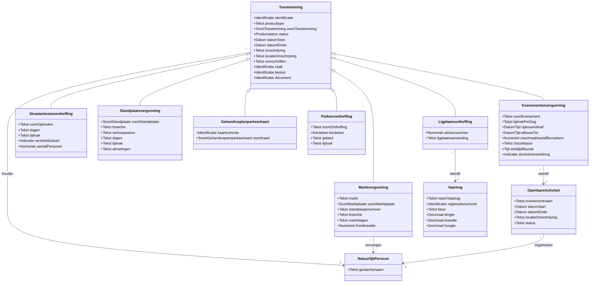

# GBO-Toestemmingenmodel

Het toestemmingenmodel beschrijft de **verleende toestemming**: de vergunning of
ontheffing die een gemeentelijk bestuursorgaan aan een houder heeft verleend,
met de gegevens die per vergunningsoort verschillen. Het staat naast het
kernmodel, dat de landelijke basisregistraties beschrijft, en naast het
voorzieningenmodel, dat de uitwisseling beschrijft. De canonieke bron is het
LinkML-schema `toestemmingen.yaml`, in de modelbron onder `publicatie/linkml/`.

Het model heeft een **eigen ontologie-namespace**,
`https://lod.gbo-semantiek.nl/toestemmingen/` (prefix `gbotm:`), en wordt als
eigen artefact gepubliceerd: `GBO-Toestemmingen.ttl` en
`GBO-Toestemmingen-Shapes.ttl`.

!!! info "Herkomst"
    Dit model is de GBO-vertaling van de pilotversie van het
    GGM-wijzigingsvoorstel *Toestemming en Product*. Klassenamen, attributen en
    definities volgen dat voorstel; de afwijkingen staan hieronder onder
    Pilot-vereenvoudigingen. Het voorstel zelf laat na de pilot alle klassen
    doorgroeien naar Model Dienstverlening, Model Vergunningen en Model
    Parkeren; GBO neemt die indeling niet over, maar houdt de klassen wel
    herkenbaar.

---

## Waarom een eigen objecttype

In het huidige gemeentelijke gegevenslandschap bestaat een verleende vergunning
alleen als *besluit* in een zaak. Voor drie vragen is dat te weinig:

- **"Mijn vergunningen" tonen** aan de houder, met geldigheid en status.
- **Toezicht op straat**: een BOA, markt- of havenmeester controleert een
  vergunning op kenteken, standplaats of ligplaats.
- **De vergunning in de wallet**: een digitale toestemming die de houder kan
  tonen, vraagt niets bijzonders van het gegevensmodel, alleen dat de vergunning
  een eigen, goed gedefinieerd objecttype is met houder, geldigheid, status en
  typespecifieke attributen.

Het besluit blijft de juridische handeling; de toestemming is het resultaat. Zij
ontstaat door een besluit in een zaak, heeft daarna een eigen levensloop en kan
door latere besluiten worden gewijzigd of ingetrokken.

## Eén generiek objecttype

Vergunning en ontheffing zijn allebei beschikkingen (Awb art. 1:3). Zij
verschillen in normstructuur — "verbod behoudens vergunning" tegenover "algemeen
verbod met individuele uitzondering" — maar niet in de gegevens die zij dragen.
Daarom kent het model één generiek objecttype `Toestemming`, met de juridische
soort als kenmerk in plaats van een klasse per juridische vorm.

`Toestemming` is niet abstract: vergunningsoorten zonder eigen klasse
(collectevergunning, kampeerontheffing, geluidsontheffing) worden als generieke
toestemming vastgelegd, met de soort in het veld `producttype`. Alleen soorten
met eigen gegevens die een aparte klasse rechtvaardigen, krijgen een
specialisatie.

## Pilot-vereenvoudigingen

Vier bewuste afwijkingen ten opzichte van het wijzigingsvoorstel, alle terug te
draaien zonder gegevensverlies:

| Onderwerp | In het voorstel | In dit model | Waarom |
|---|---|---|---|
| Zaak, Besluit, Document | relaties naar RGBZ-objecttypen | identificatie-tekstvelden `zaak`, `besluit`, `document` | RGBZ-Zaak, -Besluit en -Document zijn nog niet in GBO gemodelleerd |
| Producttype | relatie "is van" naar objecttype `Producttype` | tekstveld `producttype` met code of naam | de catalogus valt buiten de pilot |
| `soortToestemming` | kenmerk van `Producttype` | attribuut op `Toestemming` | zolang producttype tekst is, zou het onderscheid vergunning/ontheffing anders nergens vastliggen |
| Houder | `Rechtspersoon` (RSGB) | `NatuurlijkPersoon` (kernmodel) | de pilot gaat over vergunningen aan personen; geldt ook voor vervanger en organisator |

Twee klassen uit het wijzigingsvoorstel staan **niet** in dit model:

- **Parkeervergunning** blijft in de pilot ongewijzigd en erft niet van
  `Toestemming`; zij hoort bij Model Parkeren en is geen GBO-objecttype. Een
  bewonersparkeervergunning kan wel als generieke `Toestemming` met producttype
  "parkeervergunning" worden vastgelegd, met kenteken en gebied in
  `omschrijving` en `locatieOmschrijving`.
- **Ventvergunning** staat wel in het voorstel maar niet in het pilot-diagram en
  volgt in een tweede slag.

De pilot legt geen bitemporele historie vast: de levensloop van een toestemming
loopt via `status`, `datumStart` en `datumEinde`. Het `Voorkomen`-mixin uit het
hoofdmodel wordt daarom niet toegepast.

---

## Objecttypen en relaties



---

## Toelichting objecttypen

### Toestemming

Een door een bestuursorgaan aan een houder verleende toestemming om een
activiteit te verrichten of een situatie in stand te houden die zonder die
toestemming niet is toegestaan. Elke specialisatie erft deze kern en voegt
alleen toe wat voor die soort specifiek is.

| Attribuut | Type | Kard. | Toelichting |
|---|---|---|---|
| `identificatie` | Identificatie | 1 | Unieke identificatie (kenmerk of vergunningnummer) van de gemeente. Unieke aanduiding. |
| `producttype` | Tekst | 1 | De vergunningsoort als code of naam uit de producten- en dienstencatalogus. |
| `soortToestemming` | SoortToestemming | 0..1 | De juridische soort: vergunning, ontheffing, vrijstelling en verder. |
| `status` | Productstatus | 1 | Status in de levensloop. |
| `datumStart` | Datum | 0..1 | Datum waarop de toestemming ingaat. |
| `datumEinde` | Datum | 0..1 | Einde van de geldigheid; afwezig betekent onbepaalde tijd. |
| `omschrijving` | Tekst | 1 | De toegestane activiteit of het toegestane gebruik, zoals in het besluit verwoord. |
| `locatieOmschrijving` | Tekst | 0..1 | Locatie of gebied waarvoor de toestemming geldt. |
| `voorschriften` | Tekst | 0..1 | Verbonden voorschriften en beperkingen. |
| `zaak` | Identificatie | 0..1 | De zaak waarin de toestemming is aangevraagd en verleend. |
| `besluit` | Identificatie | 1..* | Het verleningsbesluit en latere wijzigings-, verlengings- of intrekkingsbesluiten. |
| `document` | Identificatie | 0..* | De vergunning als document, aanhangsels, tekeningen. |

| Relatie | Naar | Kard. | Toelichting |
|---|---|---|---|
| `houder` | NatuurlijkPersoon | 1 | De persoon aan wie de toestemming is verleend. |

### Evenementenvergunning

Toestemming van de burgemeester voor het organiseren van een evenement: een voor
publiek toegankelijke verrichting van vermaak op of aan de weg of in de openbare
ruimte (Model-APV art. 2:25). De geldigheid omvat de evenementdag of -dagen
inclusief op- en afbouw.

| Attribuut | Type | Kard. | Toelichting |
|---|---|---|---|
| `soortEvenement` | Tekst | 1 | Muziekevenement, braderie, optocht, sportevenement, buurtfeest, kermis, circus. |
| `tijdvakPerDag` | Tekst | 0..1 | Tijden waarbinnen het evenement per dag mag plaatsvinden. |
| `opbouwVanaf` | DatumTijd | 0..1 | Tijdstip vanaf wanneer de opbouw is toegestaan. |
| `afbouwTot` | DatumTijd | 0..1 | Tijdstip waarop de afbouw gereed moet zijn. |
| `maximaalAantalBezoekers` | Numeriek | 0..1 | Maximaal aantal gelijktijdig aanwezige bezoekers. |
| `risicoklasse` | Tekst | 0..1 | A is regulier, B is aandacht, C is risicovol. |
| `eindtijdMuziek` | Tijd | 0..1 | Uiterste tijdstip voor versterkte muziek. |
| `alcoholverstrekking` | Indicatie | 0..1 | Indicatie dat zwak-alcoholhoudende drank wordt verstrekt. |

| Relatie | Naar | Kard. | Toelichting |
|---|---|---|---|
| `betreft` | OpenbareActiviteit | 1 | Het evenement zelf. |

Het evenement is een eigen ding omdat het meerdere besluiten kan kennen: de
evenementenvergunning, een ontheffing op grond van Alcoholwet art. 35 en een
verkeersbesluit. De vergunning verwijst ernaar en herhaalt naam, data en
organisator niet.

### Straatartiestenontheffing

Ontheffing van de burgemeester van het verbod om als straatartiest,
straatfotograaf, tekenaar, filmoperateur of gids op te treden op aangewezen
wegen, dagen en uren (Model-APV art. 2:9). De houder is de artiest; bij een groep
de contactpersoon. De aangewezen wegen staan in het geërfde
`locatieOmschrijving`.

| Attribuut | Type | Kard. | Toelichting |
|---|---|---|---|
| `soortOptreden` | Tekst | 1 | Muziek, zang, levend standbeeld, acrobatiek, portrettekenen, rondleiding, straatfotografie. |
| `dagen` | Tekst | 0..1 | Dagen of data waarop mag worden opgetreden. |
| `tijdvak` | Tekst | 0..1 | Tijden waarbinnen mag worden opgetreden. |
| `versterktGeluid` | Indicatie | 1 | Indicatie dat geluidsversterking is toegestaan. |
| `aantalPersonen` | Numeriek | 0..1 | Aantal personen dat gezamenlijk optreedt. |

### Standplaatsvergunning

Toestemming van het college voor het innemen of hebben van een standplaats: een
vaste plaats op of aan de weg of op een andere openbare plaats, buiten een markt
(Model-APV art. 5:17–5:18). De standplaatslocatie staat in het geërfde
`locatieOmschrijving`.

| Attribuut | Type | Kard. | Toelichting |
|---|---|---|---|
| `soortStandplaats` | SoortStandplaats | 1 | Vast, seizoensgebonden of incidenteel. |
| `branche` | Tekst | 1 | Vis, bloemen, oliebollen, ijs, snacks, kerstbomen. |
| `verkoopwaren` | Tekst | 0..1 | Nadere omschrijving van goederen of diensten. |
| `dagen` | Tekst | 1 | Dagen waarop de standplaats mag worden ingenomen. |
| `tijdvak` | Tekst | 0..1 | Tijden waarbinnen de standplaats mag worden ingenomen. |
| `afmetingen` | Tekst | 0..1 | Toegestane afmetingen van de verkoopinrichting in meters. |

### Marktvergunning

Toestemming van het college voor het innemen van een standplaats op een door de
gemeente ingestelde warenmarkt (Model Marktverordening art. 2 e.v.; Gemeentewet
art. 160). Een vaste standplaats geldt doorgaans voor onbepaalde tijd, een
dagplaats voor één marktdag.

| Attribuut | Type | Kard. | Toelichting |
|---|---|---|---|
| `markt` | Tekst | 1 | Naam of aanduiding van de markt. |
| `soortMarktplaats` | SoortMarktplaats | 1 | Vaste standplaats, dagplaats of standwerkersplaats. |
| `standplaatsnummer` | Tekst | 0..1 | Nummer van de standplaats op de markt. |
| `branche` | Tekst | 1 | Groente en fruit, kaas, textiel. |
| `marktdagen` | Tekst | 1 | Dagen waarop de vergunning geldt. |
| `frontbreedte` | Numeriek | 0..1 | Toegewezen frontbreedte in meters. |

| Relatie | Naar | Kard. | Toelichting |
|---|---|---|---|
| `vervanger` | NatuurlijkPersoon | 0..* | Personen die de houder bij afwezigheid mogen vervangen. |

### Gehandicaptenparkeerkaart

Kaart volgens Europees model, verstrekt aan een persoon met een beperking of aan
een instelling, die recht geeft op het gebruik van gehandicaptenparkeerplaatsen
(BABW art. 49–55; Regeling gehandicaptenparkeerkaart). Formeel geen vergunning
maar een Europees erkend bewijs dat van parkeerverboden ontheft; daarom
`soortToestemming` "ontheffing". De kaart is persoonsgebonden, niet
voertuiggebonden, en geldt maximaal vijf jaar.

| Attribuut | Type | Kard. | Toelichting |
|---|---|---|---|
| `kaartnummer` | Identificatie | 1 | Nummer zoals op de kaart vermeld, uniek per kaart. |
| `soortKaart` | SoortGehandicaptenparkeerkaart | 1 | Bestuurder, passagier of instelling. |

Medische gegevens zoals het keuringsadvies worden niet vastgelegd.

### Parkeerontheffing

Ontheffing van het college van een parkeerverbod, een parkeerschijfzone of een
geslotenverklaring voor een bepaald voertuig (RVV 1990 art. 87; Model-APV
art. 5:2–5:8).

| Attribuut | Type | Kard. | Toelichting |
|---|---|---|---|
| `soortOntheffing` | Tekst | 1 | Blauwe zone, voetgangersgebied, milieuzone, grote voertuigen, autobedrijf, reclamevoertuig. |
| `kenteken` | Kenteken | 0..1 | Kenteken van het voertuig waarvoor de ontheffing geldt. |
| `gebied` | Tekst | 0..1 | Zone of gebied waar de ontheffing geldt. |
| `tijdvak` | Tekst | 0..1 | Dagen en uren waarop de ontheffing geldt. |

### Ligplaatsontheffing

Toestemming om met een vaartuig een ligplaats in te nemen op of in openbaar water
waar een ligplaatsverbod geldt (Model-APV art. 5:25). Bestaande GGM-klasse die in
de pilotversie van `Toestemming` gaat erven.

| Attribuut | Type | Kard. | Toelichting |
|---|---|---|---|
| `stickernummer` | Numeriek | 0..1 | Nummer van de afgegeven sticker of het vignet. |
| `ligplaatsaanduiding` | Tekst | 0..1 | Steiger, kade of nummer van de ligplaats. |

| Relatie | Naar | Kard. | Toelichting |
|---|---|---|---|
| `betreft` | Vaartuig | 1 | Het vaartuig waarvoor de ontheffing is verleend. |

### Ondersteunende objecttypen

**OpenbareActiviteit** is een voor publiek toegankelijke activiteit in de
openbare ruimte, met naam, tijdvak, locatie en organisator. Zij bestaat los van
de vergunning omdat één evenement meerdere besluiten kan kennen.

| Attribuut | Type | Kard. | Toelichting |
|---|---|---|---|
| `evenementnaam` | Tekst | 1 | Naam waaronder de activiteit wordt aangekondigd. |
| `datumStart` | Datum | 0..1 | Datum waarop de activiteit begint. |
| `datumEinde` | Datum | 0..1 | Datum waarop de activiteit eindigt. |
| `locatieOmschrijving` | Tekst | 0..1 | Locatie van de activiteit. |
| `status` | Tekst | 0..1 | Status van de activiteit. |

| Relatie | Naar | Kard. | Toelichting |
|---|---|---|---|
| `organisator` | NatuurlijkPersoon | 1 | De persoon die de activiteit organiseert. |

**Vaartuig** is het vaartuig waarmee een ligplaats wordt ingenomen: `naamVaartuig`,
`registratienummer`, `kleur`, `lengte`, `breedte` en `hoogte`. Anders dan
`Voertuig` in het kernmodel is een vaartuig niet aan een landelijke registratie
ontleend; de gegevens komen uit de aanvraag.

---

## Enumeraties

| Enumeratie | Waarden |
|---|---|
| `SoortToestemming` | Vergunning · Ontheffing · Vrijstelling · InstemmingMetMelding · Maatwerkvoorschrift · Gedoogbeschikking · ErkenningOfRegistratie |
| `Productstatus` | Initieel · InAanvraag · Gereed · Actief · Ingetrokken · Geweigerd · Verlopen |
| `SoortStandplaats` | Vast · Seizoensgebonden · Incidenteel |
| `SoortMarktplaats` | VasteStandplaats · Dagplaats · Standwerkersplaats |
| `SoortGehandicaptenparkeerkaart` | Bestuurder · Passagier · Instelling |

De waarden van `Productstatus` zijn letterlijk afgestemd op Open Product, zodat
een registratie in Open Product of de Objecten API dezelfde levensloop kent.

---

## Bevraging

Het bron-profiel `vth.yaml` beschrijft wat een gemeentelijke VTH-registratie via
GBO beschikbaar stelt. Daaruit genereert de pipeline een GraphQL-SDL met één
query per vergunningsoort, elk met dezelfde twee sleutels: het bsn van de houder
en het vergunningnummer.

```graphql
toestemming(bsn: BSN!, identificatie: Identificatie!): [Toestemming!]
overigeToestemming(bsn: BSN!, identificatie: Identificatie!): [OverigeToestemming!]
evenementenvergunning(bsn: BSN!, identificatie: Identificatie!): [Evenementenvergunning!]
straatartiestenontheffing(bsn: BSN!, identificatie: Identificatie!): [Straatartiestenontheffing!]
standplaatsvergunning(bsn: BSN!, identificatie: Identificatie!): [Standplaatsvergunning!]
marktvergunning(bsn: BSN!, identificatie: Identificatie!): [Marktvergunning!]
gehandicaptenparkeerkaart(bsn: BSN!, identificatie: Identificatie!): [Gehandicaptenparkeerkaart!]
parkeerontheffing(bsn: BSN!, identificatie: Identificatie!): [Parkeerontheffing!]
ligplaatsontheffing(bsn: BSN!, identificatie: Identificatie!): [Ligplaatsontheffing!]
```

`toestemming` levert de interface en daarmee elke soort; met een fragment op de
soort komen de typespecifieke gegevens mee. De acht andere queries leveren één
soort, voor afnemers die geen fragment-spreads willen schrijven.

De VTH-registratie is geen personenbron: van de houder levert zij alleen het bsn
en de naam waaronder de vergunning is verleend. Omdat de aanvraag via DigiD
loopt, is elke houder in de pilot een ingeschreven persoon.

---

## Aansluiting op landelijke ontwikkelingen

- **ZGW-API's en Open Zaak.** Zaak en besluit worden ongewijzigd gebruikt; de
  toestemming verwijst ernaar. Registratie van toestemmingen kan in de Objecten
  API (één objecttype per specialisatie) of in Open Product.
- **Uniforme Productnamenlijst (Logius).** Elke uitgewerkte soort heeft een
  uniforme productnaam met URI en grondslag. Zodra `Producttype` een objecttype
  wordt, verwijst het daarheen, zodat gemeenten dezelfde typering gebruiken ook
  wanneer lokale artikelnummers of de naam verschillen.
- **Model-APV, Marktverordening, RVV en BABW.** De definities en attributen
  volgen de begrippen uit deze regelingen, zodat zij herkenbaar zijn voor
  vergunningverleners en toezichthouders in elke gemeente.
